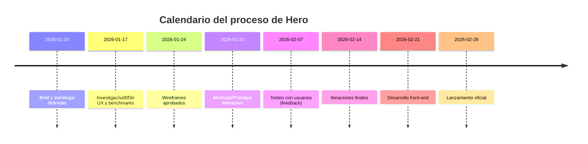

# Informe sobre “Hero Sections” premiadas en web

**Resumen ejecutivo:** Tras analizar una amplia selección de sitios galardonados (Awwwards, CSS Design Awards, Behance, Dribbble), identificamos las claves de diseño de “hero sections” de nivel *award*: tipografía de gran impacto, jerarquía visual clara, uso magistral del color y espacio, interacción avanzada (animaciones, scroll, WebGL/Lottie, etc.) y una cuidada experiencia UX accesible. También documentamos el proceso de diseño (brief, research, wireframes, prototipos, testeo) y compartimos snippets técnicos reproducibles (HTML/CSS/JS y ejemplos en React/Vue/Svelte), optimización de assets (SVG, video, Lottie) y patrones de layout reutilizables (hero con formulario, con CTAs múltiples, navegación inmersiva). Incluimos tablas comparativas (técnicas vs. frameworks) y diagramas Mermaid para flujos de trabajo. Finalmente se sugieren métricas (CTA clicks, scroll depth, bounce rate) y tests A/B (titular, imagen/vídeo, color CTA, disposición) para optimizar el hero. Se emplean fuentes oficiales (Awwwards, CSSDA) y guías técnicas en español para cada sección.

## 1. Ejemplos premiados de *Hero Sections* 

A continuación 25 ejemplos ganadores de premios de diseño web, indicando en cada caso el premio/galardón, URL, y elementos clave del hero:

- **RISK** (Site of the Day, Awwwards 15 Jul 2026). Estudio de postproducción. Su hero ocupa toda la pantalla con vídeo de fondo en slider horizontal. Usa paleta monocroma (negro y beige), tipografía grande y desplazamiento 3D. Integración de WebGL y *motion* sutil, destacando un preloader estilizado.  
- **House of Honey** (Site of the Day, Awwwards 14 Jul 2026). Estudio de interiores. Hero minimalista de estilo editorial: fondo blanco, tipografía serif enorme (“Designed with pleasure”) y líneas finas. Paleta cálida (marrón y beige). Microinteracciones suaves en hover y scroll le dan elegancia. Ganó por “elegancia editorial y fluidez interactiva”.  
- **PP Neue Montreal** (Site of the Day, Awwwards 13 Jul 2026). Sitio de tipografía. Hero tipográfico dominante con titulares superpuestos en blanco y rojo intenso sobre fondo blanco, destacando la fuente. Incorpora sofisticadas animaciones y transiciones *full-screen* (scroll horizontal). Uso atrevido del color rojo #D82F2F y tipografía personalizada.  
- **Longbow** (Site of the Day, Awwwards 12 Jul 2026). Web de coches deportivos. Hero limpio de fondo gris (#888C8F) con texto blanco: titular “Be moved — At The Speed Of Lightness” en gran tamaño. Diseño **minimalista**, gran interlineado y animación sutil al hacer scroll. Resalta sensación de “velocidad y ligereza” con tipografía sans-serif audaz.  
- **Vectr** (Site of the Day, Awwwards 11 Jul 2026). Startup de staffing con IA. Hero corporativo con fondo oscuro y texto principal azul brillante (“The New Standard in Staffing”). Iconografía moderna y animaciones WebGL (Three.js) para gráficos interactivos. Paleta de contraste (azul eléctrico #3932DC sobre negro). Ganó por su mensaje claro (“AI-driven precision”) y UX inmersivo.  
- **21 Hrs On The Moon** (Site of the Day, Awwwards 10 Jul 2026). Experiencia conmemora misión lunar. Hero oscuro tipo cinemático con imágenes de la Luna. Incorpora mapa interactivo lunar 3D y sonido espacial. Uso intensivo de WebGL/3D para efectos de profundidad y animaciones sofisticadas (ej. panorama de estrellas). Paleta blanca y azul oscuro. Destaca por su narrativa inmersiva y sonido.  
- **Get Blue** (Website of the Day, CSSDA 14 Jul 2026). App de salud. Hero de fondo negro con un gran icono central y titular “Clarity today – Longevity tomorrow”. Diseño limpio, texto centrado en columnas y fotografías inspiradoras parallax en scroll. Ganó Website of the Day (score 8.13) por su UI minimalista y CTA destacado.  
- **Vero New-York** (Website of the Day, CSSDA 13 Jul 2026). Galería de arte de vestidos. Hero tipográfico apilado (“where your wedding dress becomes art.”) con texto blanco muy grande sobre fondo claro. Entrada animada al cargar (“0%” estilo progreso WebGL) y scroll silencioso. Fondo blanco y negro con foto en scroll. Destaca por su tipografía cinematográfica y carga interactiva.  
- **COBLOC** (Website of the Day, CSSDA 12 Jul 2026). Estudio de arquitectura. Hero editorial en francés, fondo blanco y texto negro grande (“Bonjour. Nous sommes Cobloc Architecture…”). Tipografía altísima (línea de base ajustada) y scroll con transición suave. Diseño *diseño racionalista* que enfatiza sostenibilidad y detalle. Ganó por una narrativa inmersiva centrada en tipografía.  
- **SSTR Friction Reduction** (Website of the Day, CSSDA 10 Jul 2026). Ingeniería de petróleo. Hero técnico con animación de carga (“// ПОДОЖДИТЕ // … 0%”) en ruso y titular sólido (“Расширяем границы достижимого в бурении”). Diseño editorial minimalista en blanco y negro, con modelos 3D de piezas. Ganó por combinación de 3D, parallax y tipografía que “refuerzan su mensaje tecnológico”.  
- **Dolce & Gabbana Beauty Gift Finder** (Website of the Day, CSSDA 6 Jul 2026). Herramienta IA para regalo de belleza. Hero interactivo *immersive*, animaciones “liquid” y estética premium acorde a la marca D&G. Diseño minimalista con vídeos/modelos 3D, CTAs claros. Ganó por su UX personalizado alimentado por IA, recorriendo el catálogo de productos de forma elegante.  
- **ICare – WorldLabs Showcase** (Website of the Day, CSSDA 5 Jul 2026). Experiencia interactiva de salud mental. Hero introductorio con texto grande (“Massive worlds with Marble. Rendered in web with Spark 2.0”). Uso intensivo de WebGL para entornos inmersivos (fuego/agua, nebulosas). Ganó por sus efectos 3D envolventes y scroll fluidos, mostrando gráficas e infografías animadas.  
- **Curio Tech** (Website of the Day, CSSDA 4 Jul 2026). Portal de empleo tecnológico. Hero bilingüe con pregunta impactante (“Are you Craving? – 夢を、欲しがれ。”) en tipografía blanca sobre fondo oscuro. Animación de carga numérica y breve vídeo/personas en background. Combina fotografía corporativa y vídeo. Ganó por balancear visuales cinematográficos con testimonios de empleados (multiidioma, video/sound).  
- **Spotify Wrapped Party** (Website of the Day, CSSDA 3 Jul 2026). Evento social gamificado. Hero animado multicolor con gráficos vectoriales y audio. Múltiples usuarios comparten una “fiesta” musical en tiempo real. Ganó por experiencia interactiva masiva (multijugador) con sonido envolvente y visuales vibrantes.  
- **Radian EXR** (Website of the Day, CSSDA 2 Jul 2026). Lanzamiento de moto eléctrica. Hero con modelo 3D de la moto sobre fondo degradado, frase “A new era of enduro starts here”. Navegación paso a paso (01/09 indicando cada sección). Usa animación de rotación del producto y video asíncrono. Ganó por mostrar el producto de forma espectacular (efectos de brillo, scroll cinemático).  
- **Aramco – Shoot For The Future** (Website of the Day, CSSDA 12 Jun 2026). Proyecto deportivo comunitario. Hero “Shoot for the Future” con imágenes de cancha deportiva renovada. Uso de scroll vertical narrativo con slides informativos. Paleta corporativa verde/azul y tipografía clara. Elementos multimedia (video embeds, galería). Ganó por UX educativo: cuenta historia de innovación comunitaria en deporte.  
- **GQ & Audemars Piguet – The Extraordinary Lab** (Website of the Day y Mes, CSSDA 2 Jun 2026). Experiencia inmersiva de relojes. Hero fullscreen con introducción narrativa (“Follow a story told by Cam Wolf… Click to enable sound”), invitando a scroll y sonido. Diseño experimental con WebGL, audio 3D y animaciones transicionales. Ganó por elevadísima innovación en storytelling multimedia (narración interactiva de marca).  
- **Artem Shcherbakov – Portfolio** (Website of the Day, CSSDA 17 Jun 2026). Portafolio de director CGI/VFX. Hero “Hey I’m Artem” con un avatar animado 3D (cabeza modelada) integrado vía WebGL. Tipografía grande en H1 y frases cortas explicativas. Fondos oscuros y saturados de contenido visual (material 3D, motion graphics). Ganó por su estilo cinematográfico y su “truco” de animación facial realista al cargar.  
- **Gucci – Mystery Unfolds** (Site of the Day, CSSDA 5 Jun 2026). Juego de misterio de moda. Hero interactivo con gráficos ilustrados estilo cómic. Héroe con opción de narración por IA (Google Gemini), inventando una trama de investigación. Diseño responsivo con ilustraciones animadas (cómic), tipografía elegante de marca. Ganó por su atractivo juego narrativo y tecnología IA de fondo.  
- **Ten Years Away** (Website of the Day, CSSDA 10 Jun 2026). Comic interactivo de estudio de diseño. Hero tipo viñeta ilustrada que se despliega al hacer scroll, contando 10 años de historias reales. Uso creativo de ilustraciones secuenciales, animadas con WebGL. Ganó por mezclar diseño de cómic con interacción web, enriqueciendo la marca del estudio.  
- **Kenichi Aikawa** (Website of the Day, CSSDA 25 Jun 2026). Portafolio de fotógrafo. Hero elegante con fondo negro, texto blanco (“Kenichi Aikawa is a photographer…”) y carga progresiva (0%). Uso tipográfico tipografía amplia y slider de fotos en segundo plano. Ganó por destacar la fotografía al estilo “cine” y transiciones sutiles.  
- **The Power of Storytelling** (Website of the Day, CSSDA 3 Jun 2026). Experiencia 3D corporativa. Hero inmersivo con transición de fuego a hielo en 3D. Narrativa visual sobre cómo se forma la marca. Uso intensivo de shaders WebGL y scroll parallax para efectos de profundidad. Ganó por sus llamativos efectos de fuego/agua 3D y storytelling ambiental.  
- **Wembi** (Website of the Day, CSSDA 16 Jun 2026). Web de simulador digital. Hero colorido con degradados, gran lema tipográfico (“Wembi improves the performance…”). Scroll tipográfico vertical e imágenes técnicas. Ganó por paleta llamativa y scroll tipográfico (“typographic, scroll, colorful”) que ilustra su producto de gemelo virtual.  
- **Studio Minimal – Gossan (portfolio)** (Mención honorífica Awwwards, 2023). Concepto de portfolio 3D. Hero ultra-rápido con gráficos 3D personalizados (Three.js) y textos flotantes. Fue reconocido en Awwwards “por experiencia 3D inmersiva y rendimiento optimizado”. Demuestra cómo integrar escenas WebGL complejas con tiempos de carga mínimos (usando Astro + Three.js).

Estos ejemplos galardonados ilustran tendencias punteras: texto grande y claro, imágenes/vídeos de alta calidad, interacción fluida y un mensaje de valor inmediato.  

## 2. Principios de diseño visual y composición

- **Jerarquía visual:** El titular (“headline”) debe ser lo primero en captar la atención. Debe estar en H1 de gran tamaño y comunicar el valor central en pocas palabras. Un subtítulo o párrafo breve aclara la oferta. Ej.: *“Muebles hermosos y artesanales entregados a tu puerta”* es mucho más eficaz que frases vagas.  
- **Tipografía:** Usar fuentes legibles y consistentes. Elegir una fuente de gran impacto para el titular (serif o sans-serif bold según el branding) y una más neutra para el cuerpo. Ajustar interletraje e interlineado para legibilidad (ej. condensar headers, espaciado cómodo para párrafos). Respetar contraste WCAG (ratio ≥4.5:1 para texto normal). La accesibilidad UX/UI exige interfaces que “se perciben, se entienden y se pueden usar sin barreras”, por lo que el color de texto debe contrastar claramente con el fondo.  
- **Color y contraste:** Elegir paleta de 2–3 colores principales acorde a la marca. Muchas secciones hero ganadoras usan un fondo neutro (blanco o negro) con uno o dos colores llamativos en el texto/CTA. Ejemplo: House of Honey emplea marrón/beige suave; PP Neue Montreal, rojo intenso sobre blanco. El CTA debe destacarse (color secundario brillante) para que sea visible de inmediato.  
- **Espacio y composición:** Usar generosos espacios en blanco alrededor del mensaje clave para dirigir la mirada. Centrando vertical y horizontalmente el contenido principal (títulos, imágenes) se guía al usuario al mensaje. Mantener márgenes consistentes (grilla) para alinear texto e imágenes. Por ejemplo, RISK y Longbow usan estructuras centradas simétricas.  
- **Retícula (grid):** Construir el diseño sobre una malla flexible (CSS Grid o Flexbox) facilita la responsividad. Una columna central grande para el hero, con márgenes laterales fluidos, es una práctica habitual. Cada elemento (texto, botón, imagen) se alinea a la retícula para mantener orden visual.  
- **CTA clara:** Incluir una llamada a la acción prominente. DreamHost recomienda evitar multiplicar botones en el hero: mejor una sola CTA “grande y llamativa”. Por ejemplo: “Empieza ahora”, “Solicita demo”, con color vivo y suficiente padding. El botón debe estar cerca del texto clave (jerarquía) y contrastar con el fondo.  

En resumen, un buen hero usa la jerarquía (gran H1 > subtítulo > botón) para narrar rápidamente el valor. El diseño debe ser limpio, con contraste accesible, espacio equilibrado y una sola acción principal destacada.

## 3. Técnicas avanzadas de interacción y animación

- **Microinteracciones:** Pequeñas animaciones de feedback (hover en botones, iconos que vibran, carga en CTA) dan sensación de pulido. Definidas como “una animación a modo de retroalimentación” tras una acción de usuario, añaden placer estético sin saturar. Ventajas: guían la interacción e “insertan un efecto *wow* intuitivo”, mejorando la UX. Inconvenientes: si se abusa puede distraer o afectar rendimiento; debe usarse con moderación (p.ej. animaciones CSS simples, microtransiciones de 200–300ms).  
- **Parallax scrolling:** Capas que se mueven a distinta velocidad crean profundidad. Usado en muchos heroes para dar dinamismo al desplazarse. Sin embargo, cuidado: Nielsen Norman alerta que el parallax “añade interés visual, pero a menudo crea problemas de usabilidad como carga lenta o contenido difícil de leer”. Por tanto hay que optimizarlo: cargar primero el contenido crítico, permitir scroll nativo (“scroll hijacking” limitado), y ofrecer una versión sin parallax si el rendimiento se resiente.  
- **Scroll-triggered animations:** Animaciones que se inician al llegar a cierto scroll (fade-ins, deslizamientos, efectos de texto). Enganchan al usuario progresivamente. Ventaja: revelan información gradualmente, manteniendo interés. Contras: pueden confundirse con scripts de carga; usar librerías optimizadas (como **ScrollTrigger** de GSAP) y asegurarse de que el contenido HTML esté presente (para accesibilidad y SEO).  
- **Lottie y animaciones vectoriales:** Lottie (Airbnb) permite importar animaciones JSON de After Effects como gráficos SVG/Canvas. Sus beneficios son claros: archivos muy ligeros, escalabilidad infinita y soportadas en web/móvil. Se integran fácil (componentes `<lottie-player>` o bibliotecas JS) y pueden ser interactivas (respuesta a scroll/click). Ventaja: calidad de animación muy alta, código reutilizable. Inconveniente: requiere cargar la librería Lottie y la animación JSON, lo que añade peso; hay que optimizarlas (reducir puntos vectoriales).  
- **WebGL / Three.js / Shaders:** Permiten efectos 3D avanzados en el canvas del navegador. Se usan en heroes ganadores para experiencias inmersivas (modelos 3D que rotan, fondos animados en 3D, partículas). Pros: gráficos espectaculares, interacción rica (p. ej. 21 Hrs On The Moon, RISK). Contras: gran carga en GPU/CPU, complejidad de programación (requiere conocimiento GL), cuidado de fallback para navegadores móviles (por ejemplo, mostrar un vídeo o imagen estática si no hay soporte WebGL). Siempre optimizar geometrías/texturas y reducir llamadas de draw.  
- **Shaders y efectos avanzados:** Con GLSL se pueden crear efectos visuales únicos (distorsiones, blends). Ejemplo: filtrado de vídeo en tiempo real, transiciones animadas. Ventajas: visuales de alto nivel, diferenciadores creativos. Inconvenientes: rendimiento intensivo y curva de aprendizaje alta.  
- **Performance y carga:** Toda animación debe estar optimizada: usar *lazy loading* (p.ej. `loading="lazy"` en imágenes), compresión de assets, prioridad a la vista inicial (Above the Fold). Medir impacto con Lighthouse. Las técnicas como Lottie y WebGL son potentes, pero es vital asegurarse de que el sitio sigue rápido (FPS ≥ 30).  

## 4. Proceso de diseño y UX (wireframes, prototipos, testing)

Un desarrollo profesional de un hero de nivel premiado sigue varias fases:

```mermaid
flowchart LR
    A[Brief del proyecto] --> B[Investigaci\u00f3n UX]
    B --> C[Wireframes / Estructura]
    C --> D[Prototipos interactivos]
    D --> E[Test de usuario (feedback)]
    E --> F[Iteraci\u00f3n y optimizaci\u00f3n]
    F --> G[Desarrollo t\u00e9cnico final]
```

- **Brief & objetivos:** Definir metas del hero (p.ej. aumentar leads, destacar nuevo producto, transmitir marca). Documentar requerimientos, público objetivo y competencia.  
- **Investigación (benchmark):** Estudiar ejemplos destacados (como los anteriores), tendencias de sector, preferencias de usuario. Recopilar imágenes, tipografías y paletas inspiradoras.  
- **Wireframes / UX:** Esquematizar la estructura (donde va cada elemento: logo, titular, CTA, imagen/fondo). Validar flujo de usuario: el héroe debe dejar claro qué ofrece el sitio y qué hacer a continuación. Suele usarse grillas 12-columna para móviles y desktop.  
- **Prototipo visual:** En Figma/Sketch se desarrolla el diseño final del héroe: colores definitivos, tipografías exactas, imágenes o vectores SVG, animaciones planificadas. Se pueden hacer prototipos en herramientas interactivas para simular scroll o hover.  
- **Testeo:** Probar el prototipo con usuarios reales (usabilidad, comprensión del mensaje, atractivo visual). Test A/B posibles: alternar titular, imagen de fondo o color CTA. Herramientas: Google Optimize, Optimizely. Se analizan métricas como *clicks en CTA*, *tiempo en sección* y *scroll depth* para validar la eficacia.  
- **Accesibilidad (WCAG):** Garantizar que el hero sea accesible: texto alternativo en imágenes, contraste adecuado (ratio ≥4.5:1 para textos pequeños), usar etiquetas `<h1>`, `<button>`, roles ARIA si es necesario, y navegación por teclado (p.ej. el carousel/slider del hero se debe poder manejar con flechas). Recordar que “la accesibilidad web implica que cualquiera pueda usar el producto, incluyendo personas con discapacidades visuales, auditivas, motrices o cognitivas”.  
- **Checklist final:** Antes de lanzar, revisar:  
  - Titular claro y central.  
  - Subtítulo explicativo breve.  
  - Imagen/video/SVG optimizados (compresión).  
  - CTA destacado (único, con buena jerarquía).  
  - Funcionalidades animadas funcionando (hover, scroll).  
  - Responsive design: hero adaptado a móviles (menos altura, fuentes más pequeñas).  
  - Inclusión de fuentes seguras (p.ej. Google Fonts preload).  
  - SEO básico (texto visible en HTML).  
  - Pruebas de carga y correcciones de bugs.



## 5. Detalles técnicos reproducibles

**HTML/CSS/JS básico:** Un hero típico puede construirse así:

```html
<section class="hero">
  <div class="hero-content">
    <h1>Tu Titular Principal Aquí</h1>
    <p class="subtitle">Breve descripción del producto/servicio.</p>
    <a href="#cta" class="btn-primary">Empieza Ahora</a>
  </div>
</section>
```
```css
.hero {
  position: relative;
  width: 100%;
  height: 80vh; /* o alto completo de pantalla */
  background: url('hero.jpg') center/cover no-repeat;
  display: flex;
  align-items: center;
  justify-content: center;
  text-align: center;
  color: #fff;
}
.hero-content { max-width: 600px; margin: 0 1rem; }
.btn-primary {
  display: inline-block;
  margin-top: 1em;
  padding: 0.75em 2em;
  background: #FF4500;
  color: #fff;
  text-transform: uppercase;
  font-weight: bold;
  border: none;
  cursor: pointer;
}
@media (max-width: 768px) {
  .hero { height: 60vh; }
  .hero h1 { font-size: 2rem; }
}
```

**Frameworks (componentes):** En React/Vue/Svelte se define el mismo HTML como componente:

- *React (Next.js)*:
  ```jsx
  function Hero() {
    return (
      <section className="hero">
        <div className="hero-content">
          <h1>Bienvenido a Nuestro Servicio</h1>
          <p>Descripción breve sobre el valor ofrecido.</p>
          <button className="btn-primary">Contáctanos</button>
        </div>
      </section>
    );
  }
  export default Hero;
  ```

- *Vue/Nuxt*:
  ```vue
  <template>
    <section class="hero">
      <div class="hero-content">
        <h1>{{ title }}</h1>
        <p>{{ subtitle }}</p>
        <button class="btn-primary">{{ ctaText }}</button>
      </div>
    </section>
  </template>
  <script>
  export default {
    data() {
      return {
        title: 'Bienvenido a Nuestro Servicio',
        subtitle: 'Descripción breve sobre el valor ofrecido.',
        ctaText: 'Contáctanos'
      }
    }
  }
  </script>
  ```

- *Svelte*:
  ```svelte
  <script>
    export let title = "¡Descubre Nuestro Producto!";
    export let subtitle = "Cómo puede beneficiarte en segundos.";
    export let ctaText = "Empezar ahora";
  </script>
  <section class="hero">
    <div class="hero-content">
      <h1>{title}</h1>
      <p>{subtitle}</p>
      <button class="btn-primary">{ctaText}</button>
    </div>
  </section>
  ```

**Integración de assets:**  
- **Imágenes:** Usar formatos modernos (WebP, AVIF) y generar versiones responsive (`srcset`). Cargar `loading="lazy"` y `decoding="async"`. Tener **fondo de reserva** para héroes con video o canvas.  
- **Vídeo:** Se puede usar `<video autoplay muted loop poster="poster.jpg">` para fondo. Incluir `playsinline` y atributo `poster` como fallback image. Considerar calidad y peso (cache) vs experiencia.  
- **SVGs:** Íconos o ilustraciones vectoriales son geniales: escalables sin pixelar, ligeros. Incrustar `<svg>` inline para animarlos con CSS/JS. Usar `viewBox` apropiado.  
- **Lottie:** Insertar como web component: e.g. `<lottie-player src="anim.json" background="transparent" speed="1" loop autoplay></lottie-player>`. Requiere incluir script Lottie (`<script src="https://unpkg.com/@lottiefiles/lottie-player@latest/dist/lottie-player.js"></script>`). Ofrece animaciones fluidas y responsive. Como precaución, comprimir el JSON con [dotLottie](https://dotlottie.io) para agrupar assets.  
- **Optimización:** Minificar CSS/JS. Usar frameworks ligeros (p.ej. SvelteKit o Astro hidratan menos JS que un SPA típico). Cargar librerías de animación desde CDN o asíncrono. Emplear **Content Delivery Network (CDN)** para media. Verificar con Chrome DevTools que el FCP (First Contentful Paint) del hero sea rápido.  
- **Responsive:** Definir breakpoints en CSS. Por ejemplo, en móviles reducir altura del hero y tamaño de fuente (como en el ejemplo CSS). Asegurar que CTA y texto encajen bien en pantalla pequeña (flex-column si es necesario).  
- **Fallbacks:** Si usamos animaciones pesadas, proporcionar alternativa: e.g. en `<noscript>` mostrar imagen estática; con JS deshabilitado que aparezca una versión simple. Para WebGL, detectar `webgl` y sino usar `` de respaldo.

**Comparativa de frameworks para héroes:**  

| Framework/Entorno   | Ventajas principales                                   | Limitaciones                                        |
|---------------------|--------------------------------------------------------|-----------------------------------------------------|
| **React / Next.js** | SSR/SSG (SEO), rico ecosistema. Fácil hacer animaciones con libraries (Framer Motion, GSAP) | Tamaño de bundle mayor (carga inicial), gestión de estado |
| **Vue / Nuxt.js**   | Similar a React, buena para transiciones (Vue Transitions). SSR con Nuxt. | Ecosistema amplio pero menos maduro que React. Bundle moderado. |
| **Svelte / SvelteKit** | Compila a JS muy ligero, excelente rendimiento y reactividad. CSS scoped. | Menos plugins; comunidad más pequeña, pero creciente. |
| **Astro**           | Escoge qué scripts cargar. Ideal para contenido estático y bloques React/Vue solo donde hace falta. | Más adecuado para páginas estáticas; no es SPA completo. |
| **Webflow / No-code** | Rápido prototipo visual, hosting integrado (ej. RISK usa Webflow). | Poca flexibilidad en código custom, difícil SEO avanzado. |

La elección depende del equipo y requisitos (por ejemplo, **House of Honey** usó Next.js para aprovechar SSR, mientras que **RISK** aprovechó Webflow para prototipado rápido).

## 6. Patrones de layout y componentes reutilizables

- **Hero con formulario:** Integrar un formulario (p.ej. suscripción, contacto) directamente en el hero. Ejemplo clásico: un **input + CTA** para newsletter. Hay que simplificar al máximo (correo + botón). Validaciones mínimas en línea (ej. no permitir “@” sin dominio). Asegurar uso de atributos accesibles (`<label>` correctamente vinculadas). Ventaja: captura leads inmediata. Contras: si es muy pesado (captcha, scripts) puede ralentizar.  
- **Hero con CTA múltiples:** A veces se ofrecen 2 acciones: primaria (p.ej. “Comprar”) y secundaria (“Ver demo”). En este caso se distinguen visualmente (botón primario llamativo y secundario más sobrio). Ejemplo inspirador: Netflix (“Suscríbete”, “Inicia sesión”). Importante que la jerarquía sea obvia (primera acción más resaltada).  
- **Hero “inmersivo” o *full-page*:** Ocupa 100% del viewport con video o animación de fondo. A menudo se combina con una barra de navegación oculta inicialmente, que aparece al hacer scroll. Ejemplo: sitios con menú minimalista (burger icon) sobre el hero. Atención: el texto y botones deben tener suficiente contraste con el vídeo.  
- **Hero con navegación por scroll:** Algunos héroes incluyen indicaciones de scroll (flechas o scroll-down) para animar al usuario a seguir. Esto crea una experiencia de paginación única (p.ej. hero fijo con contenido que aparece al scroll).  
- **Componentes preparados:** Crear clases CSS reutilizables: `.hero-title`, `.hero-subtitle`, `.hero-cta`, para mantener consistencia entre proyectos. Variantes: hero con imagen, hero con video, hero solo color sólido. Tener componentes de React/Vue para cada patrón, por ejemplo `<HeroImage bg="foto.jpg" title="..." />` vs `<HeroVideo src="intro.mp4" />`.

## 7. Métricas y pruebas A/B recomendadas

Para evaluar el impacto del hero section se recomienda monitorizar:  
- **Tasa de conversión del CTA:** ¿Qué % de visitantes hace clic en el botón principal del hero? Se puede medir en Google Analytics como evento (Event).  
- **Profundidad de scroll:** Qué porcentaje de usuarios llega hasta el final del hero y continúa scroll (herramientas: Scroll Depth). Un hero muy llamativo debería alentar al usuario a continuar.  
- **Bounce rate sobre “above the fold” (p.ej. tasa de abandono sin interacción):** Si es alta, quizás el mensaje no fue claro o tardó mucho en cargar.  
- **Tiempo en la página:** Un hero atractivo puede aumentar el “time on page” inicial.  
- **Resultados de pruebas A/B:** Testear variaciones del hero cambia las métricas. Ejemplos de variantes:  
  1. **Titular/Texto:** frases distintas (más emocionales vs más informativas).  
  2. **Imagen vs Vídeo:** video de fondo vs foto estática.  
  3. **Color del CTA:** botón en color original vs alternativo.  
  4. **Posición del contenido:** texto alineado al centro vs a la izquierda.  
  5. **Animación on/off:** hero animado vs estático.  

Usar A/B testing (Google Optimize, Optimizely, VWO) durante varias semanas para obtener datos significativos. Medir diferencias en conversión, CTR y scroll.  

## 8. Recursos y herramientas recomendadas

- **Galerías de inspiración:** Sitios como [Awwwards](https://www.awwwards.com) o [CSS Design Awards](https://www.cssdesignawards.com) ofrecen casos reales premiados (usamos múltiples ejemplos de estas fuentes). También Behance y Dribbble para hero estáticos y prototipos.  
- **Librerías y frameworks:**  
  - *Animación:* [GSAP](https://greensock.com/gsap/) (ScrollTrigger, DrawSVG), [Framer Motion](https://www.framer.com/motion/) para React, [Anime.js](https://animejs.com/).  
  - *3D/WebGL:* [Three.js](https://threejs.org/) (para escenas 3D custom), [Babylon.js](https://www.babylonjs.com/). Herramientas: [ShaderFrog](https://shaderfrog.com/) o [GLSL Sandbox](http://glslsandbox.com/) para prototipos de shaders.  
  - *Lottie:* [LottieFiles](https://lottiefiles.com/) (repositorio de animaciones), [dotLottie](https://dotlottie.io/) para empaquetar. Official `<lottie-player>` o [lottie-web](https://github.com/lottiefiles/lottie-web).  
  - *Scroll animado:* [Locomotive Scroll](https://github.com/locomotivemtl/locomotive-scroll) para efectos parallax modernos, [ScrollMagic](http://scrollmagic.io/).  
- **Diseño UI:** [Figma](https://www.figma.com/) (componentes, prototipos), [Adobe XD](https://www.adobe.com/products/xd.html). Plugins de accesibilidad (contrast checker).  
- **Pruebas UX:** [Hotjar](https://www.hotjar.com/) (heatmaps/recordings), [UserTesting](https://www.usertesting.com/), [Google PageSpeed](https://developers.google.com/speed/pagespeed/insights/) para performance.  
- **Accesibilidad:** Guías WCAG (por ejemplo [W3C WCAG 2.1](https://www.w3.org/TR/WCAG21/)). Herramientas: [axe](https://www.deque.com/axe/) o [WAVE](https://wave.webaim.org/) para auditoría. En español, recursos como *UX/UI Checklist WCAG*.  
- **Frameworks frontend:** Como vimos, Next.js (React) y Nuxt.js (Vue) son muy usados para hero dinámicos. SvelteKit es excelente para rendimiento. Para prototipado rápido de marketing sites se puede usar [Webflow](https://webflow.com/) o [WordPress con Gutenberg](https://wordpress.org/gutenberg/).  
- **Colaboración y versionado:** Git/GitHub, además de herramientas de feedback (Zeplin, InVision) para iterar diseño.  
- **Recursos adicionales:** Blogs técnicos y cursos actualizados. Ejemplos: DreamHost Blog (esp.) sobre héroes, Interactius (microinteracciones), w3.org (WCAG).  

En conjunto, este informe proporciona una hoja de ruta paso a paso y referencias concretas para replicar *hero sections* de calidad premiada: desde inspiración de ejemplos galardonados, pasando por principios de diseño sólidos, hasta técnicas avanzadas de animación con consideraciones de rendimiento. Siguiendo este enfoque integral y empleando las herramientas recomendadas, cualquier equipo de diseño/desarrollo podrá crear héroes web del nivel más alto. 

**Fuentes:** Se citan páginas de premios de diseño (Awwwards, CSSDA) para ejemplos, blogs y guías en español (DreamHost, Interactius, UDIT) para principios de UX/Accesibilidad, y recursos técnicos (SVGator para Lottie).